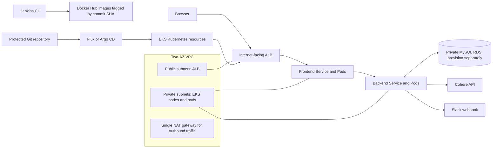

# AWS EKS deployment path

This is the optional AWS implementation path. Terraform creates the network and EKS managed control plane/node group. Jenkins remains a CI publisher, and Flux or Argo CD remains the Kubernetes deployment mechanism.

## Architecture



The Terraform files provision a two-AZ VPC, public load-balancer subnets, private worker subnets, one NAT gateway, an EKS cluster and a managed node group. The sample intentionally uses a single NAT gateway to limit development costs; it is a single-AZ egress dependency. Production should use resilient egress, private EKS API access where practical, private RDS with backups and encryption, and monitored capacity. Terraform does not create Jenkins, RDS, the load balancer controller, External Secrets, DNS, ACM certificates, application secrets, or the GitOps controller.

Jenkins currently pushes to Docker Hub. Create public repositories named `todo-backend` and `todo-frontend` under the configured namespace, or adapt the CI and add private-registry pull credentials to the Kubernetes workloads. Public image repositories expose application code, so keep credentials and sensitive build artifacts out of images. EKS nodes need outbound connectivity to pull images and call package/external APIs.

## Security and access

- Authenticate with IAM Identity Center/federation or another short-lived role. Do not place AWS access keys in the repository, Jenkinsfile, or shell history.
- The Terraform caller receives EKS cluster creator admin access. Use a restricted infrastructure role, then provision named EKS access entries and remove unnecessary administrative access.
- The EKS API allows public access only from `eks_public_access_cidrs`. Set this to your current trusted IPv4 CIDR `/32` (or approved office/VPN range); do not use `0.0.0.0/0`. Restrict cluster security groups and avoid public worker nodes.
- The AWS Load Balancer Controller needs a dedicated IAM role through EKS Pod Identity or IRSA. Follow the current AWS controller install guide and create the controller before applying the EKS ingress overlay.
- Store DB, Cohere and Slack values in AWS Secrets Manager or SSM Parameter Store and sync them with External Secrets Operator or another approved mechanism. Enable EKS envelope encryption and use TLS to the database. Kubernetes Secret objects alone are not encrypted in Git and base64 is not encryption.
- Attach an ACM certificate in the same AWS region as the ALB and point DNS to the ALB. The overlay requires the certificate ARN and a hostname update.
- Configure CloudTrail, control-plane audit logs, AWS Budgets and cleanup procedures. Restrict Terraform state access; configure encrypted remote state with locking for a shared/prod environment.

## Provision the sample cluster

Prerequisites: AWS CLI v2, Terraform 1.6+, `kubectl`, authenticated IAM role with reviewed VPC/EKS/IAM permissions, and a known public egress CIDR for the administrator. Review service quotas and costs first. The example defaults to `ap-south-1`, Kubernetes 1.36 and two `t3.medium` managed nodes; confirm support and instance capacity in your selected region before provisioning.

PowerShell:

```powershell
Set-Location aws/terraform
Copy-Item terraform.tfvars.example terraform.tfvars
notepad terraform.tfvars
terraform init
terraform fmt -check
terraform validate
terraform plan -var-file=terraform.tfvars
terraform apply -var-file=terraform.tfvars
```

Replace `198.51.100.25/32` in `terraform.tfvars` with your actual trusted public CIDR. The TEST-NET value is documentation-only and will not give you access. Review every planned resource and cost before `apply`. After successful creation:

```powershell
$region = 'ap-south-1' # must match terraform.tfvars
$cluster = 'todo-summary-dev' # must match terraform.tfvars
aws eks update-kubeconfig --region $region --name $cluster
kubectl get nodes
kubectl get namespaces
```

Expected: `kubectl get nodes` lists the requested managed nodes as `Ready`. This does not mean the application has been deployed.

## Provision remaining dependencies

1. Create private MySQL 8 (recommended: RDS Multi-AZ for production) with backups, encryption, TLS, and network rules allowing only the EKS workload path. Record the endpoint, DB name, username, and password securely.
2. Install the AWS Load Balancer Controller following the current AWS EKS guide. Associate its service account with its least-privilege IAM role using EKS Pod Identity or IRSA. Wait for its deployment to be ready.
3. Create or select an ACM certificate in this region; configure the DNS hostname that users will visit.
4. Configure External Secrets Operator and its least-privilege IAM role, or provision the Kubernetes secret out of band. Populate `todo-secrets` in namespace `todo` with keys `DB_USERNAME`, `DB_PASSWORD`, `COHERE_API_KEY`, and `SLACK_WEBHOOK_URL`. Set the DB endpoint/name/port in `k8s/configmap.yaml`. Do not commit secret values.
5. Push the CI-built images to the selected registry. For Docker Hub, confirm the repos are pullable by EKS and the tag equals the commit SHA. Update the two Deployment image tags and registry namespace in Git.
6. Update the EKS overlay hostname in `k8s/ingress.yaml` and replace `REPLACE_WITH_ACM_CERTIFICATE_ARN` in `k8s/overlays/eks/kustomization.yaml`.
7. Install Flux or Argo CD and configure the protected GitOps source to reconcile `k8s/overlays/eks`. Use the manifests in Git; do not use Jenkins to apply/delete cluster resources.

See `../DEPLOYMENT_RUNBOOK.md` for the full CI/GitOps sequence and validation commands. AWS references: [EKS version lifecycle](https://docs.aws.amazon.com/eks/latest/userguide/kubernetes-versions.html), [AWS Load Balancer Controller](https://docs.aws.amazon.com/eks/latest/userguide/aws-load-balancer-controller.html), [ALB Ingress](https://docs.aws.amazon.com/eks/latest/userguide/alb-ingress.html), and [EKS node IAM role](https://docs.aws.amazon.com/eks/latest/userguide/create-node-role.html).

## Tear down

Only after deleting data and confirming the cluster is no longer needed, run `terraform destroy -var-file=terraform.tfvars` from this directory. Destroy RDS and other separately provisioned services only through their own reviewed lifecycle process. Terraform state contains infrastructure metadata; never publish it.
